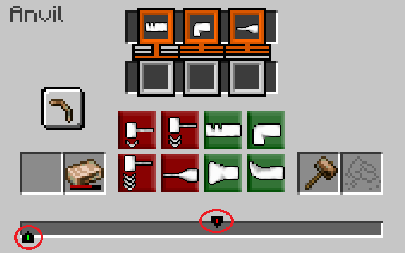
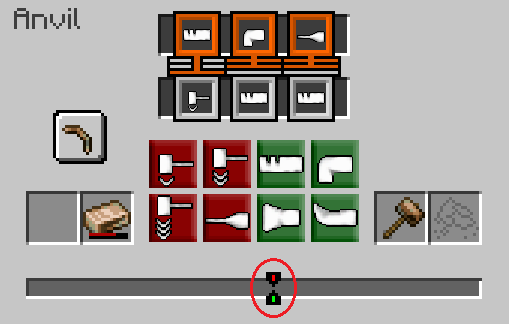
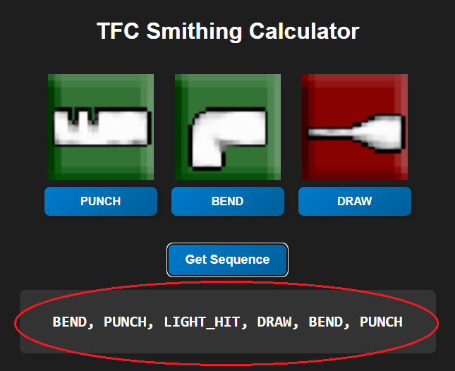
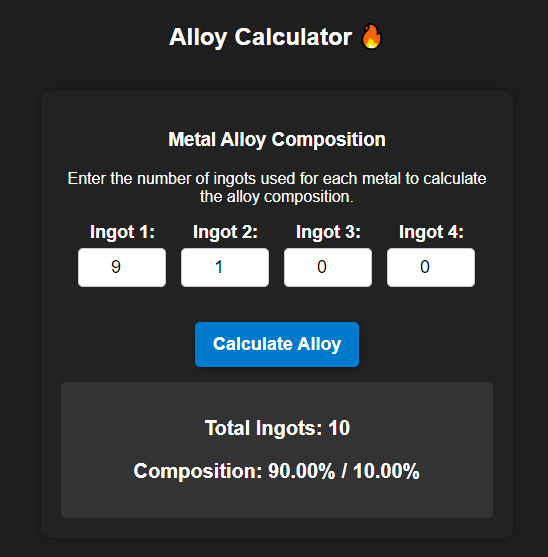

# TFC Smithing Calculator 🔨🔥

A tool to assist players in the **Terrafirmacraft** mod by calculating the correct forging sequences and alloy compositions. This ensures that players can successfully forge and smelt alloys without trial and error.

🔗 **Access the tool here:** [TFC Smithing Calculator](https://augustokonzen.github.io/TFCSmithingCalculatorWeb/)

## Features 🚀

- ✅ **Forging Calculator** – Determines the correct sequence of actions to forge an item.
- ✅ **Alloy Calculator** – Calculates the ingot composition for metal alloys.
- ✅ **Intuitive UI** – Simple, clean, and easy to use.
- ✅ **Fully Responsive** – Works on desktops and mobile devices.
- ✅ **In-depth Tutorial** – Guides players step by step in using the tool.

## How to Use 🛠

### **Forging Process 🔨**

1. Select the **exact same actions** as shown in the game.
2. Align the two **forging indicators** before starting the sequence.
3. Apply the **calculated sequence** to successfully forge the item.



<p>Before starting the forging process, you must align the two indicators shown in the red circles. Regardless of the selected sequence, forging will fail if these points are not aligned.</p>



<p>Once the two indicators are perfectly aligned, you can follow the calculated sequence step by step. The system determines the optimal order of actions required to forge the item successfully.</p>



<p>Select the exact same actions as shown in the game, align the points, and apply the sequence generated by this system. If followed correctly, the forging process will succeed.</p>

---

### **Alloy Calculator 🔥**

1. Enter the number of **ingots** used for each metal.
2. Click **Calculate Alloy** to determine the final composition.
3. View the total number of ingots and their percentage in the alloy.



<p>The **Alloy Calculator** helps determine the final number of ingots and their composition based on the input materials.</p>

<p><strong>Important:</strong> This tool calculates <u>ingots</u>, not raw ore pieces. In **Terrafirmacraft**, mining ores like **Malachite** (for copper) provides **ore chunks** that must be refined into molten metal. The game requires combining different pieces (Poor, Normal, Rich) to form full ingots. This calculator assumes you already have ingots ready for alloying.</p>

---

## Hosting & Deployment 🌍

This project is hosted via **GitHub Pages**. To update the live version:

```sh
git add .
git commit -m "Update site"
git push origin main
```

---

## Contribution 🤝

Contributions are welcome! Feel free to submit **issues** or **pull requests** to improve the tool.

---

## License 📜

This project is licensed under the **MIT License** – feel free to modify and share!

---

💡 Built with love for **Terrafirmacraft** players. Happy forging and smelting! 🔥🛠
